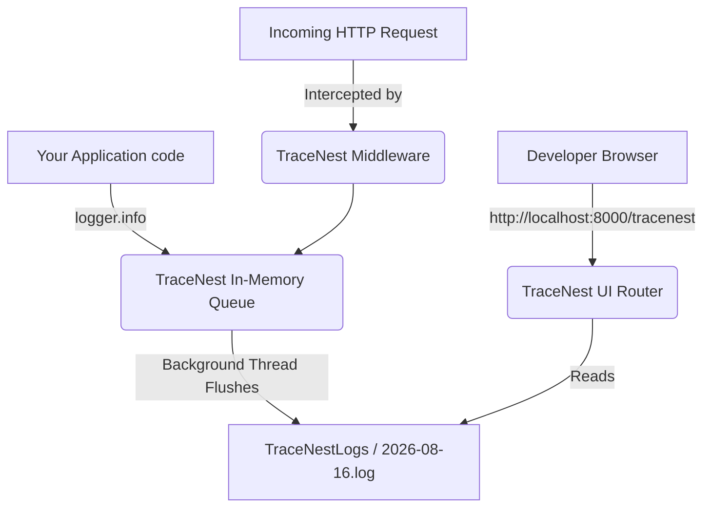
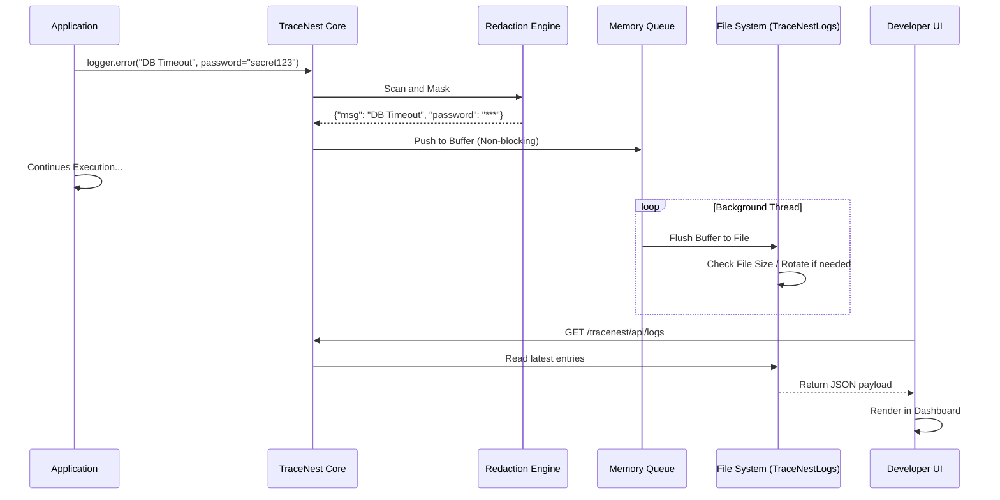

# TraceNest

TraceNest is a **developer-first, local-first logging SDK for Python applications** designed to remove the operational burden of log management from developers.

You focus on building features.  
TraceNest takes care of logging.

---

## 📖 What is TraceNest?

TraceNest is not just a logger. It is a **logging infrastructure layer** embedded directly into your application. It automatically creates, manages, rotates, and retains logs. Best of all, it provides a built-in UI to view those logs directly from your application without needing external services like ELK, Datadog, or CloudWatch.

### 🚀 Features So Far
- **Zero-configuration setup:** Works out of the box.
- **Automatic `TraceNestLogs/` folder creation:** No need to setup directories manually.
- **Day-wise or single-file logging modes:** Flexible storage options.
- **Strict size and retention enforcement:** Automatically rotates and deletes old logs.
- **Built-In UI:** A beautiful, responsive, and dark-mode compatible UI served directly from your app.
- **Native FastAPI middleware:** Automatically captures HTTP requests and unhandled exceptions.
- **Built-in Secret Redaction:** Prevents credentials, API keys, and passwords from leaking.
- **High Performance:** Buffered I/O and background threads ensure your app never slows down.

---

## 🗂️ Types of Logs Managed

TraceNest handles several types of logs out of the box:
1. **Application Logs:** Custom logs you write (`logger.info`, `logger.error`, etc.).
2. **HTTP Request Logs:** (When using FastAPI) Automatically logs incoming requests, response codes, and durations.
3. **Exception Logs:** Captures unhandled exceptions and tracebacks automatically.
4. **Security Logs:** Safely masks sensitive data like `Authorization` headers, passwords, and API keys.

---

## ⚙️ Installation & Implementation

### 1. Installation

Install TraceNest via pip:
```bash
pip install tracenest
```

### 2. Basic Python Implementation

For a standard Python application or script, simply import the logger and use it.

```python
from tracenest import logger

# TraceNest automatically initializes and creates the TraceNestLogs/ folder
logger.info("Application started successfully")

try:
    1 / 0
except Exception as e:
    logger.error("A critical error occurred", error=str(e))
```

### 3. FastAPI Implementation (with UI and Middleware)

To fully leverage TraceNest in a FastAPI application, integrate the middleware and the UI router.

```python
from fastapi import FastAPI
from tracenest.fastapi import TraceNestMiddleware, setup_tracenest
from tracenest import logger

app = FastAPI()

# 1. Add Middleware to log all HTTP requests automatically
app.add_middleware(TraceNestMiddleware)

# 2. Setup the TraceNest UI (Access it at http://localhost:8000/tracenest)
setup_tracenest(app)

@app.get("/")
def read_root():
    logger.info("Root endpoint accessed")
    return {"message": "Hello World"}
```

*After running your FastAPI app, visit `http://localhost:8000/tracenest` to see your logs in real-time!*

---

## 🛠️ How it Works (For Developers)

When you install and import TraceNest into your project, it seamlessly injects itself into your application lifecycle.

### Step-by-Step Developer Workflow
1. **Import:** The moment `from tracenest import logger` is executed, TraceNest's core initializes.
2. **Initialization:** It checks for the existence of `TraceNestLogs/` in your root directory. If missing, it creates it.
3. **Queue Creation:** It spawns a background thread and an in-memory queue to handle log writing without blocking your main application thread.
4. **Middleware Injection:** When `TraceNestMiddleware` is added, it wraps around the ASGI application to intercept all incoming requests.
5. **UI Mounting:** When `setup_tracenest(app)` is called, TraceNest mounts static files and API routes to serve the dashboard.

### Architecture Diagram



---

## 🔄 The TraceNest Lifecycle

Understanding the lifecycle of a single log message helps illustrate why TraceNest is safe and performant.

### Step-by-Step Lifecycle
1. **Capture:** A log event is generated via `logger.info()` or the `TraceNestMiddleware`.
2. **Redaction:** The event is immediately scanned for sensitive keys (e.g., passwords, tokens) and redacted.
3. **Buffering:** The structured log is placed into a thread-safe in-memory queue (O(1) operation). Your application continues executing immediately.
4. **Flushing:** A background worker thread wakes up periodically (or when the queue reaches a threshold) and writes the buffered logs to the disk sequentially.
5. **Rotation & Retention:** During the flush, TraceNest checks the file size and date. If the file is too large or it's a new day, it rotates the file and deletes logs older than the retention period (default 60 days).
6. **Streaming:** If a developer has the UI open, the UI periodically polls the TraceNest backend, which reads the latest logs from disk and streams them to the browser.

### Lifecycle Diagram



---

## 🎨 Built-In UI

TraceNest provides a robust web UI out of the box:
- **Live log streaming:** Auto-refreshing dashboard.
- **Deep-dive details:** Slide-out panel for traceback and structured data.
- **Search and filtering:** Filter by log level (INFO, ERROR, etc.) or text search.
- **Themes:** Dark, Light, Dark Blue, Emerald, Ruby, Amethyst, and Midnight.

---

## 🔒 Security and Redaction

TraceNest includes built-in secret redaction. It recursively searches through dictionaries, lists, request data, and log strings to mask:
- Passwords
- API Keys
- JWT Tokens
- Authorization Headers
- Database connection strings

Logs are redacted **before** they hit the in-memory queue, ensuring secrets never touch the disk.

---

## 📜 Versioning & Changelog

TraceNest follows semantic versioning. For full release notes, check the `CHANGELOG.md` file.

---

## 🧑‍💻 Author & Maintainer

**VishwajitVM**

- 📍 New Delhi, India  
- 🐙 GitHub: https://github.com/vishwajitvm  
- ✉️ Email: vishwajitmall50@gmail.com  

TraceNest is actively maintained with a strong focus on real-world production use cases, developer experience, and long-term scalability.

---

## 📄 License

TraceNest SDK is free to use and distributed under the MIT license.
