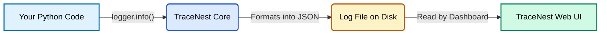

# 01. Introduction to TraceNest

Welcome to **TraceNest**! If you're tired of messy, unreadable `print()` statements cluttering your terminal, you are in the right place.

## What is TraceNest?
At its core, TraceNest is a **logging library and a web dashboard**. 

When you write a program (like a web server or a data pipeline), you need to record what it's doing so that if something breaks, you know exactly why. Developers usually do this by writing "logs" (e.g., "User logged in", "Database connection failed").

**TraceNest does two things:**
1. **The Logger (Backend):** It takes your simple log messages and transforms them into organized, structured data (JSON format). It automatically adds the exact time, the file name, and safely hides passwords.
2. **The Dashboard (Frontend):** It provides a beautiful, modern Web UI where you can view, search, and filter these logs in real-time, just like reading a highly organized spreadsheet.

## Why Do You Need It?
Imagine a scenario where thousands of users are using your app. Suddenly, an error occurs. 

Without TraceNest, you would have to open a massive, plain-text text file on your server and manually scroll through tens of thousands of lines trying to find the one error message. 

**With TraceNest:**
- You open the **Web Dashboard** in your browser.
- You click the **"Error"** dropdown filter.
- You instantly see only the errors.
- You click an error to open the **Details Panel** and see exactly which line of code caused it.

## How it Works (High-Level)

Here is a simple diagram showing how information travels from your Python code into the Web Dashboard:

1. **You write code:** You use `logger.info("Hello World")`.
2. **TraceNest formats it:** It packages "Hello World" with the current time and saves it as a neat JSON object.
3. **TraceNest saves it:** It writes it to a file named `app.log` on your computer.
4. **The UI reads it:** The Web Dashboard reads `app.log` and displays it beautifully on your screen.

## Under the Hood (Technical Context)
For developers integrating TraceNest into a production stack, here is the technical summary of what TraceNest is doing:
* **The Logger:** TraceNest does not reinvent the wheel. It extends the standard Python `logging` library. `get_logger()` returns a native `logging.Logger` instance augmented with our custom formatters and handlers. This means it is 100% compatible with existing Python logging ecosystems.
* **The Formatter:** The JSON transformation is handled by a custom `logging.Formatter` subclass (`TraceNestJsonFormatter`).
* **The Backend UI:** The dashboard is not a standalone server; it is a mountable API Router. It uses FastAPI's `APIRouter` to expose a `/api/logs` endpoint, and `Jinja2Templates` combined with `StaticFiles` to serve the HTML/CSS/JS.

---
**Next Step:** Head over to [02. Quick Start](02_quick_start.md) to get this running on your computer in just 2 minutes!
