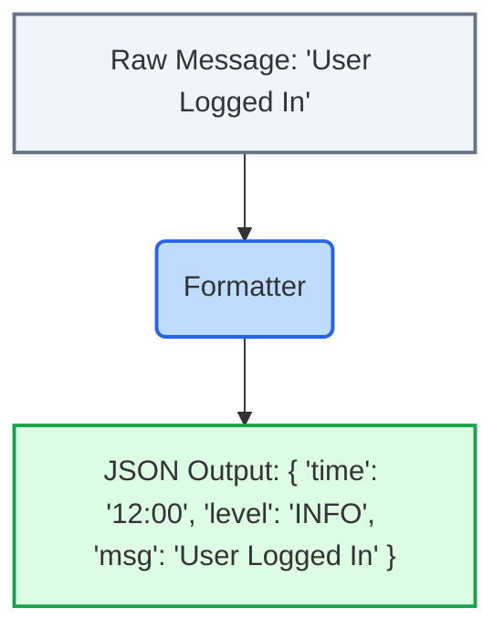

# 03. Core Concepts Explained

TraceNest uses a few very important concepts under the hood to ensure your logs are fast, safe, and beautiful. Don't worry, they are very easy to understand!

## 1. The Logger
The **Logger** is simply the main entry point you interact with in your code. When you say `logger.info("Hello")`, the logger's job is to catch that message, attach some basic context to it (like "this was a piece of INFO"), and pass it down the assembly line.

## 2. The Formatter
The **Formatter** is the designer of the assembly line. It takes the raw, boring text message ("Hello") and dresses it up into a rich JSON structure.

By turning everything into JSON, the Web Dashboard can easily read it and display it in a neat table instead of a messy wall of text.

## 3. The Handler
The **Handler** is the delivery worker. Once the Formatter creates the JSON, the Handler's job is to deliver it to a destination. In TraceNest, the default handler is an `AsyncFileHandler`, which writes the JSON to a file on your hard drive (like `app.log`) *without slowing down your program*.

## 4. Retention & Rotation (Protecting Your Hard Drive)
If you run an app 24/7, it will generate *millions* of logs. If you just kept saving them to a single file, that file would eventually grow to hundreds of gigabytes and crash your server! 

To prevent this, TraceNest uses **Rotation** and **Retention**:

* **Rotation (Max Bytes):** When `app.log` gets too big (e.g., 10 Megabytes), TraceNest will "rotate" it. It renames the file to `app.log.2026-07-15` and creates a brand new, empty `app.log`.
* **Retention (Max Days):** TraceNest will look at all those old rotated files (`app.log.yesterday`, `app.log.last-week`) and automatically delete any file that is older than a specific number of days (e.g., older than 7 days). 

This means your server will *never* run out of disk space because of logs!

## 5. Configuration
**Configuration** is how you tell TraceNest exactly what you want it to do. Don't want 7 days of logs? Want 30 days? You can change that using the configuration!

We'll look at exactly how to change these settings in [05. Configuration Guide](05_configuration_guide.md).

## Under the Hood (Technical Context)
If you are wondering how this is implemented in Python:
* **The Logger:** `get_logger()` calls `logging.getLogger(name)`. TraceNest attaches a custom handler (`AsyncFileHandler`) to this standard logger.
* **The Formatter:** The `TraceNestJsonFormatter` overrides the `format(self, record: logging.LogRecord) -> str` method. It converts the standard `LogRecord` attributes (like `record.levelname` and `record.msg`) into a Python dictionary, injects any `extra` kwargs provided by the developer, and then runs `json.dumps()` to output a string.
* **The Handler (Thread Queuing):** The `AsyncFileHandler` creates an infinite-capacity, thread-safe `queue.Queue`. When you call `logger.info()`, the handler executes `self.queue.put_nowait(record)`. A background daemon `threading.Thread` runs an infinite loop (`while True:`) calling `queue.get()`, formatting the record, and writing it to the `logging.handlers.RotatingFileHandler`. 
* **Rotation:** `RotatingFileHandler` intercepts the file write. Before writing, it checks if the current file size + the new log size exceeds `maxBytes`. If it does, it calls `self.doRollover()`, which closes the file handle, renames the file (e.g., to `app.log.1`), and opens a fresh `app.log`.

---
**Next Step:** Let's take a tour of the actual code and see where everything lives in [04. Project Architecture](04_project_architecture.md).
