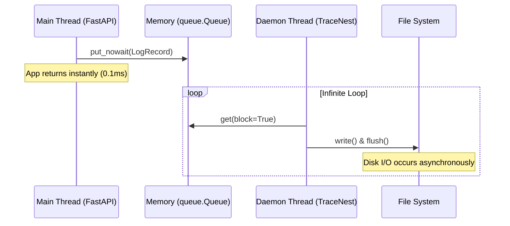

# 08. Security & Performance

When building a logging library, two things are absolutely critical: it must not leak passwords, and it must not slow down the server. TraceNest solves both of these problems brilliantly.

## 1. Security: Secret Redaction (Masking)

If a user signs up on your website, you might accidentally log their password like this:
`logger.info(f"User signed up: {email}, password: {password}")`

If a hacker gets access to your `app.log` file, they now have the user's password! 
TraceNest protects you from this mistake. Before *any* log is saved to your hard drive, TraceNest scans the text for sensitive words like `password`, `secret`, `token`, or `api_key`.

If it finds one, it completely hides the value!

**What you wrote:**
`logger.info("Attempting login with password=SuperSecret123!")`

**What TraceNest saves to the file:**
`"Attempting login with password=***"`

This feature is **On by default**, so you are protected automatically.

## 2. Performance: Asynchronous Logging

Normally, when you tell Python to save a file, it stops everything else it is doing, waits for the hard drive to spin up, saves the file, and then resumes your code. If you have 1,000 users hitting your server at the same time, this "waiting for the hard drive" will cause your server to crash or become incredibly slow.

**TraceNest is Non-Blocking.**

When you say `logger.info("Hello")`, TraceNest does NOT wait for the hard drive. 
Instead, it hands the message to a background Queue (like throwing a letter into a mailbox) and instantly goes back to running your code. 

A separate, hidden worker thread (the mailman) empties that queue and writes the logs to the hard drive in the background.

This means you can log tens of thousands of messages per second, and your web server will never even notice!

## Under the Hood (Technical Context)
Let's look at the exact mechanisms providing this security and performance.

**Security Regex Logic:**
The `SecretRedactor` filter executes before string serialization. It uses a compiled regex pattern using re.IGNORECASE to scan the incoming dictionary. 
The pattern evaluates against common dangerous keys like `(password|secret|token|api_key)`. If it detects a match, it mutates the value in-place to `'***'` before it reaches the JSON formatter.

**Performance Thread Queue Diagram:**
To visualize the non-blocking architecture, here is the thread-state flowchart:

By utilizing an unbound memory queue and a background daemon thread, blocking file I/O operations are entirely decoupled from the main execution thread of your application, ensuring zero latency impact.

---
**Next Step:** Ready to start hacking? Learn how to build your own plugins in [09. Advanced Customizations](09_advanced_customizations.md).
